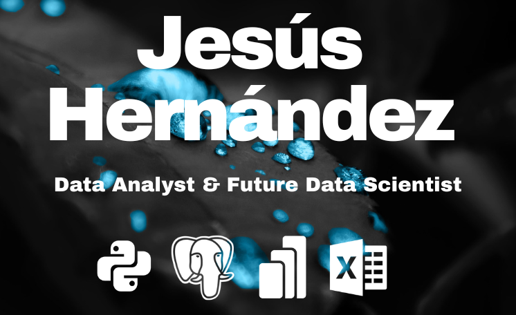

  

# Hi there, I'm Jesús 👋 🤖🧿
### Mathematics Student & Data Scientist Trainee 🚀

**"Bridging the gap between mathematical theory and data-driven decision making."**

I'm a **Mathematics student** and **Data Analyst** transitioning toward **Data Science**. My focus lies in the intersection of **Statistical Rigor** and **Scalable Data Architecture**. I don't just process data; I build reliable environments to extract its true value.

## 📊 About Me
- 🎓 Currently pursuing a **Bachelor’s in Mathematics**.
- 🧪 Specialized in **Statistical Validation** (Pearson, P-Value) and **Relational Architectures**.
- 🛠️ Expert in building **ETL pipelines** from synthetic simulations to PostgreSQL production.
- 🌍 Bilingual: **English (C2)** | **Spanish (Native)**.
- 🔭 **Currently Exploring:** Deep Learning foundations and Cloud Data Warehousing.

## 🎯 Strategic Roadmap & Future Goals
I am committed to continuous growth at the intersection of mathematical rigor and advanced computing. My current focus is on:

- **🏗️ Data Engineering:** Scaling ETL pipelines into cloud environments (AWS/Azure).
- **🧠 Deep Learning:** Exploring Neural Network architectures and their mathematical foundations for predictive modeling.
- **📉 Advanced Statistics:** Implementing Bayesian inference and Causal Analysis to drive more nuanced business decisions.
- **☁️ Cloud Computing:** Pursuing training to deploy production-ready data solutions in the cloud.

## 🛠️ My Tech Stack

### 💻 Languages & Databases

### 🧪 Data Science & Machine Learning

### 📊 Business Intelligence & Visualization

## 🚀 Featured Project
### [SaaS Retention Engine & Behavioral Analytics](https://github.com/JesusAHB25/SaaS-Retention-Engine-Behavioral-Analytics)
**The Challenge:** Identify behavioral "Aha! Moments" using synthetic event simulation and PostgreSQL.
* **Key Achievement:** Mathematically proven correlation ($r=0.74$) between profile completion and user lifespan using **SciPy**.
* **Technical Stack:** Python (NumPy/Pandas), SQL (CTEs), SQLAlchemy, Seaborn.
> [!IMPORTANT]
> [View Executive Report on Notion](https://purring-sailboat-492.notion.site/SaaS-Retention-Engine-Behavioral-Analytics-02-09-2026-2e01d3119ed0803abe62e32ed450fe4e?source=copy_link)

### [Lumina Fashion Group: End-to-End Retail Analytics](https://github.com/JesusAHB25/Lumina-Fashion-Group-End-to-End-Retail-Analytics-Pipeline)
**The Challenge:** Unify 4 fragmented data domains and optimize profit margins using SQL & Python.
* **Key Achievement:** Developed a Star Schema architecture and identified a "Discount Paradox" through median-based aggregation.
* **Strategic Outcome:** Recommended volume-based bundling to protect profitability, preventing a 15% margin erosion.
> [!IMPORTANT]
> [Explore the Full Strategic Case Study on Notion](https://purring-sailboat-492.notion.site/Lumina-Fashion-Group-Retail-Analytics-End-to-End-Pipeline-2b01d3119ed08066b5f9f147da60599c)

## 📈 My GitHub Stats

  
  

## 📫 Let's Connect:

